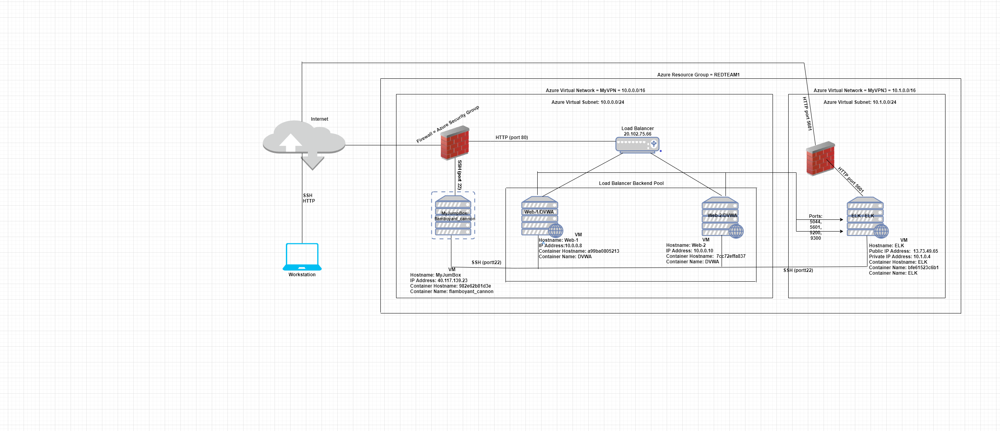
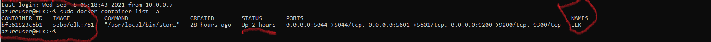

## Automated ELK Stack Deployment

The files in this repository were used to configure the network depicted below.

These files have been tested and used to generate a live ELK deployment on Azure. They can be used to either recreate the entire deployment pictured above. Alternatively, select portions of the elk-deployment.yml file may be used to install only certain pieces of it, such as Filebeat.

This document contains the following details:
- Description of the Topology
- Access Policies
- ELK Configuration
  - Beats in Use
  - Machines Being Monitored
- How to Use the Ansible Build

### Description of the Topology

The main purpose of this network is to expose a load-balanced and monitored instance of DVWA, the D*mn Vulnerable Web Application.

Load balancing ensures that the application will be highly available, in addition to restricting access to the network.

Integrating an ELK server allows users to easily monitor the vulnerable VMs for changes to the log files and system services.

The configuration details of each machine may be found below.

| Name       	| Function   	| IP Address    	| Operating System 	|
|------------	|------------	|---------------	|------------------	|
| JumpBox    	| Gatway     	| 40.117.139.23 	| Linux            	|
| Web-1/DVWA 	| Web Server 	| 10.0.0.8      	| Linux            	|
| Web-2/DVWA 	| Web Server 	| 10.0.0.10     	| Linux            	|
| ELK/ELK    	| ELK Server 	| 13.73.49.65    	| Linux            	|

### Access Policies

The machines on the internal network are not exposed to the public Internet. 

Only the JumpBox machine can accept connections from the Internet. Access to this machine is only allowed from the following IP addresses:x.x.x.x

Machines within the network can only be accessed by JumpBox with IP address 10.0.0.7.

A summary of the access policies in place can be found in the table below.

| Name       	| Publicaly Accessible  	| Allowed IP Addresses 	|
|------------	|-----------------------	|----------------------	|
| JumpBox    	| Yes                   	| x.x.x.x             	|
| Web-1/DVWA 	| NO                    	| 10.0.0.7             	|
| Web-2/DVWA 	| NO                    	| 10.0.0.7             	|
| ELK Server 	| NO                    	| 10.0.0.7             	|

### Elk Configuration

Ansible was used to automate configuration of the ELK machine. No configuration was performed manually, which is advantageous because ansible can be run from command line without the use of configuration files for simple tasks, such as making sure of a service is running, or to trigger updates or reboots.

The playbook implements the following tasks:
- Install docker.io
- Download and luanch Docker ELK container impage
- Increase virtual memory
- Install Python3
- _Enable Docker service after boot

The following screenshot displays the result of running `docker ps` after successfully configuring the ELK instance.

### Target Machines & Beats
This ELK server is configured to monitor the following machines:
- Web-1/DVWA:10.0.0.8
- Web-2/DVWA:10.0.0.10

We have installed the following Beats on these machines:
- Filebeat
- Metricbeat

These Beats allow us to collect the following information from each machine:
- Filebeat monitors the log files and collect log events (unautherized SSH attempts, audit logs, server logs, etc) and forwards them to Elasticsearch
- Metricbeat collects metrics and statistics from system and services running on the server (e.g: Apache, MySQL, System, Zookeeper, etc)and ships them to Elasticsearch

### Using the Playbook
In order to use the playbook, you will need to have an Ansible control node already configured. Assuming you have such a control node provisioned: 

SSH into the control node and follow the steps below:
- Copy the install-elk.yml file to /etc/ansible/.
- Update the hosts file to include ELK server
- Run the playbook, and navigate to http://13.73.49.65:5601/app/kibana#/home to check that the installation worked as expected.

Above will only deploy ELK server, to deploy the complete solution 
- Copy the elk-deployment.yml file to /etc/ansible/
- Update the hosts file to include webservers
- Run the the playbook and check the following to see if complete solution is deployed
- http://20.102.75.66/index.php  to check id the websersver are deployed
- http://13.73.49.65:5601/app/kibana#/home to check if the ELK server is deployed.

### Below are some useful commands
Execute the below command to download the ansibles from GitHub

change directory to /etc/ansible/ and update the hosts file by running below command
nano hosts

make following changes in hosts file and add the ip address of all the DVWA servers that you are going to deploy
- uncomment [webservers]
- add ip addresses e.g: x.x.x.x ansible_python_interpreter=/usr/bin/python3

add the below lines  for the ELK server and add the ip address of ELK server
- [ELK]
- add ip addresses e.g: x.x.x.x ansible_python_interpreter=/usr/bin/python3
